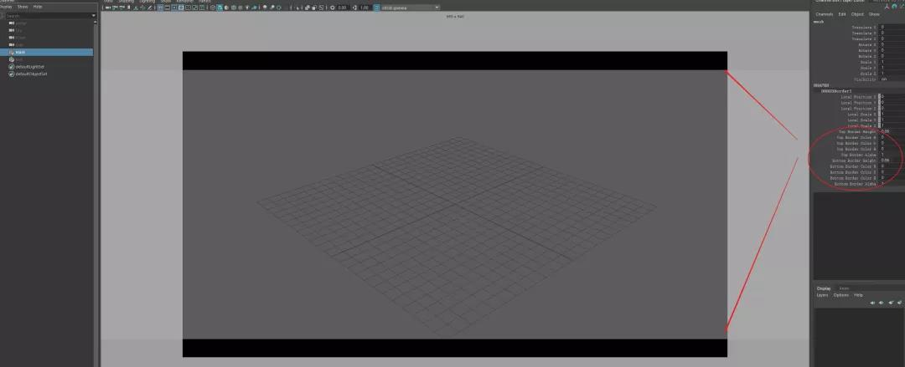
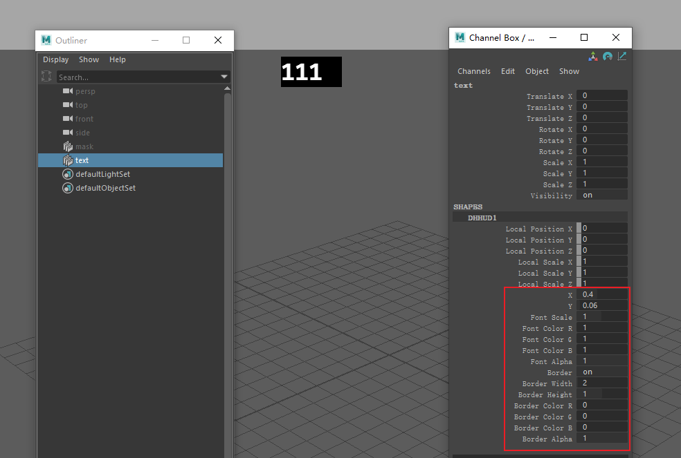

# DDHUD
nodes using vp2 to display maya heads-up-display info (idea from zshotmask(zurbrigg.com))
# Usage:
load this plugin in plugin manager. 
then run in mel: 
createNode DDHUD; 
createNode DDHUDBorder;
# 

